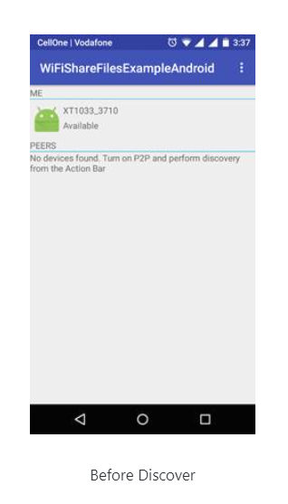
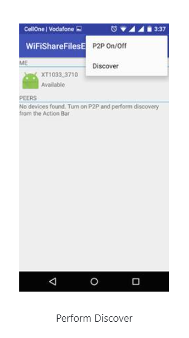
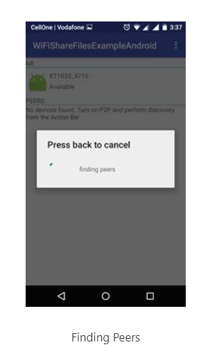
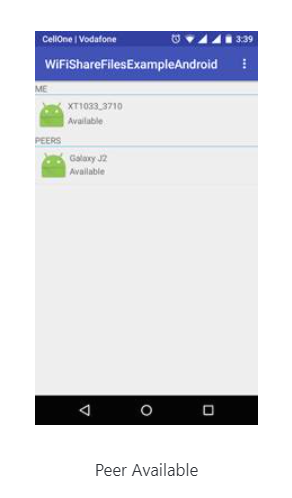
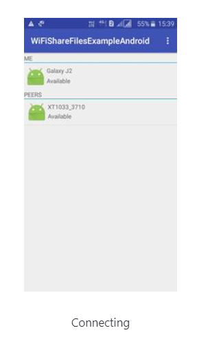
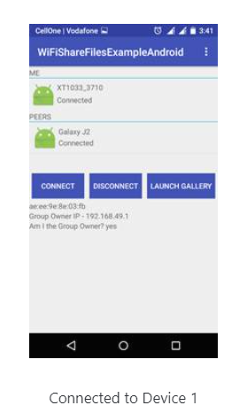
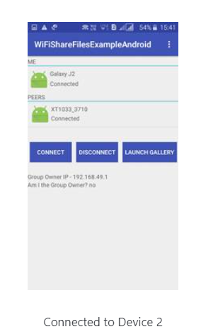
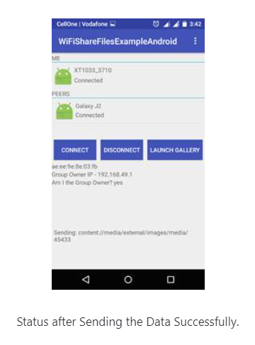

**Updated November 27, 2020**

  
 

# EasyShare - A File Sharing Android App

EasyShare is simplest but elegant self-hosted file transfer application that allow users to transfer file between multiple devices. It is an alternative application of shareit and Xender as it offers similar features.

# Features:

 Cross-platform - Only Android platform.
 
 Transfer multiple files at once, without losing progress if the transfer is interrupted or cancelled.

 File transfer speed is about 2-4 mbps.
 
 Files encrypted in transit.
 
 It supports large file transfer.

# Screenshots:

         
        

# Demo 

Presenting a recorded demo of EasyShare, click on the link below (an access to google Drive) :

https://drive.google.com/file/d/1tRlttga537eNhzMFTRs10-MRRowfAeYo/view?usp=sharing  

## Contributors

- [Jitendra Singh](https://github.com/jet0499)
- [Mani Bansal](https://github.com/ManiBansal0025)
- [Neha Adnekar](https://github.com/Nehaadnekar)
- [Prachi Bansal](https://github.com/prachi1234bansal) 
- [Vivek Goyal](https://github.com/vivek-goyal12)

You can contribute in this project by forking the project and by sending pull requests. If you do so, please don't forget to add your name to contributor's list!

## Contacts
Feel free to contact us if you have any further queries, at:
<jitendra.singh_cs18@gla.ac.in>, 
<mani.bansal_cs18@gla.ac.in>, 
<neha.adnekar_cs18@gla.ac.in>, 
<prachi.bansal_cs18@gla.ac.in>, 
<vivek.goyal_cs18@gla.ac.in> .
