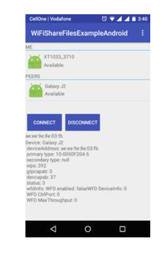

**Update November 13, 2020**

  
 

# EasyShare - A File Sharing Android App

EasyShare is simplest but elegant self-hosted file transfer App that allow users to transfer file b/w multiple devices. It is an Alternative App like shareit and Xender by offering similar features.

# Features:

 Cross-platform - Only Android platform.
 
 Transfer multiple files at once, without losing progress if the transfer is interrupted or canceled.

 Speeds is about 2-4 mbps.
 
 Files encrypted in transit.
 
 Large files supported.

# Screenshots:

            
         

   
                

# Demo 

A Demo vedio of EasyShare will be available soon ...

## Contributors

- [Jitendra Singh](https://github.com/jet0499)

You can contribute by forking the project and sending pull requests. If you do, please don't forget to add your name to this list!

## Contacts
Please do not hesitate to contact me if you have any further questions, my email address is <jitendra.singh_cs18@gla.ac.in>.
